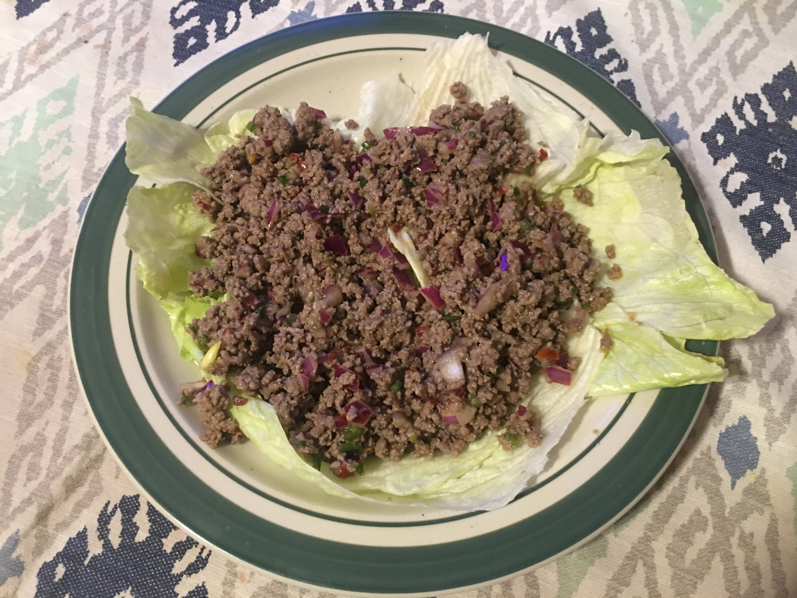

#### Ingredients

1 pound of ground beef  
1 jalapeño pepper  
1 thick slice of red onion  
3 tablespoons of peanut oil  
6 tablespoons lime juice  
1 tablespoon sriracha sauce  
2 tablespoons of fish sauce  
2 tablespoons of brown sugar
1 head of lettuce  

This recipe was adapted from the one [here](http://www.bonappetit.com/recipe/thai-larb).
Put a pan on medium heat and cover bottom with the peanut oil.
Dice all of the ground beef and throw into pan.
Dice the onion and jalapeño pepper and mix in with the beef.
Let the beef continue to cook; it should take about 15 minutes for it to brown,
Get a bowl and mix together the lime juice, sriracha sauce, fish sauce and sugar.
After the meat has browned, throw in the contents of the bowl and stir.
Turn the heat low and let set for about five minutes.
Break off leaves from the lettuce and cover a plate with them.
Serve the larb on top of the lettuce.

