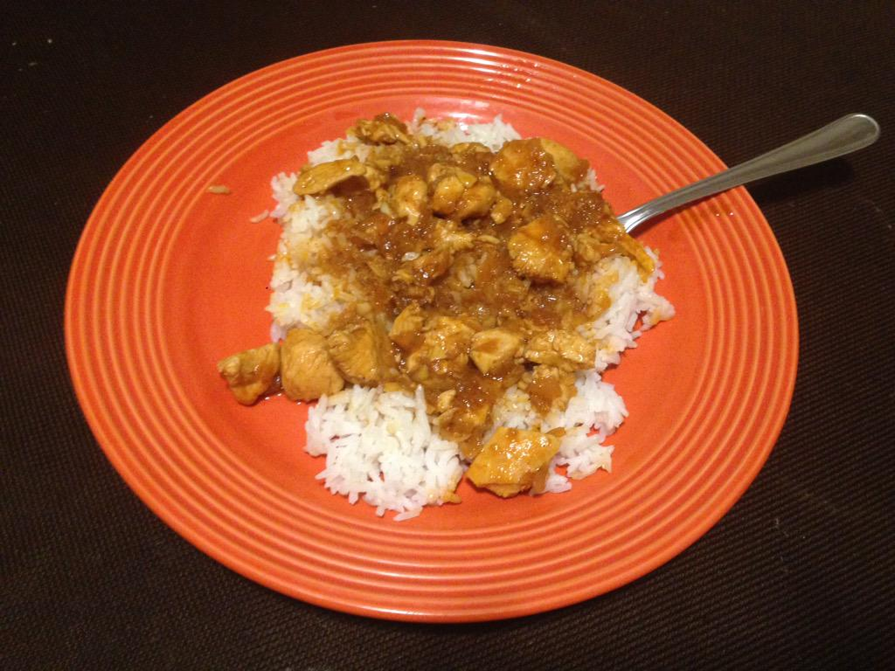

This is a modifed version of thie recipe found [here](http://www.daringgourmet.com/2013/08/27/doro-wat-spicy-ethiopian-chicken-stew/).

### Part 1 - Sautée onions

#### Ingredients

1/2 large white onion  
2 tablespoons EVOO  
2 tablespoons butter  
2 big cloves garlic  
1 tablespoon of minced ginger (which equates to about an inch of root)  

Heat onions et. al medium for about twenty minutes. Keep putting just a tiny amount of chicken broth or water in to prevent browning or burning.

### Part 2 - Develop the sauce

#### Ingredients

1 cup of chicken broth  
5 tablespoons berbere spice  
1/2 cup white wine  
1 tablespoon salt  
3 tablespoons lemon juice  
2 plum tomatoes  

Dice the tomatoes and throw them and the rest of the ingredients into the pan.
(You may or may not want to "mush" or otherwise puree the tomatoes such that the resultant sauce is less chunky.)
Heat for another fifteen minutes or so.

### Part 3a - Add chicken

#### Ingredients

1 chicken breast

Dice into small cubes and throw into sauce and let whiten.

### Part 3b - Prepare rice

#### Ingredients

1 1/2 cups of white rice

Make rice; I like to throw in a tablespoon of butter into the rice to insure that it's tasty and doesn't stick to the ricemaker. :S

### Part 4 - Serve and enjoy!

Put rice on dish and ladle as much of the sauce and chicken as desired.

