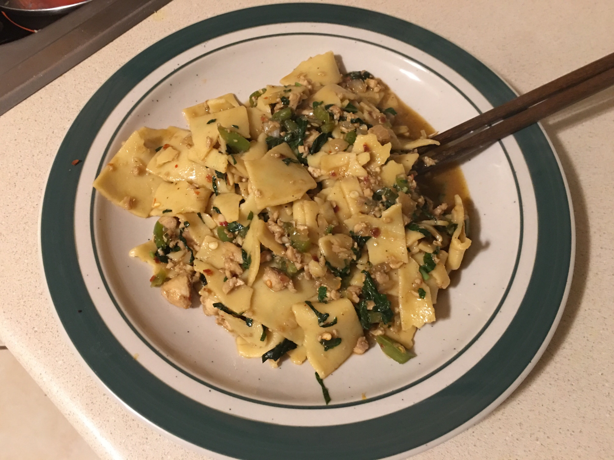

This recipe was adapted from [here](http://www.templeofthai.com/recipes/stir_fry_chicken_recipes.php).

### Ingredients

10-12 ounces medium egg noodles  
4 tablespoons oyster sauce  
2 tablespoons sweet soy sauce  
4 tablespoons "regular" soy sauce  
3 tablespoons sugar  
3 tablespoons water  
1/2 pound of chicken  
1 medium green bell pepper  
1/3 medium onion  
3 cloves of garlic  
1 ounce of basil  
1/2 tablespoon fish sauce  

Boil a pan of water and then throw in the noodles.
Add the three sauces along with the sugar water in a small dish and stir until everything mixes.
Set aside.
Line a pan with EVOO.
Dice the chicken into small cubes.
Throw them all into the pan and cook until just beyond white.
Take all the chicken out of pan and dice further until nearly minced.
Set aside on a plate.
Dice pepper, onion, and garlic and put in pan and cook until starting to brown.
Put chicken back into pan and turn heat down to below medium.
Return to the noodle and keep cooking them until beyond al dente.
Strain and set aside.
Dice basil and throw into the pan with the chicken and vegetables.
Pour the noodles into pan and the sauce over it.
Stir until everything is distributed evenly.
Throw in enough water to avoid burning.
Throw in EVOO to avoid clumping.
Add fish sauce and perhaps additional salt depending on your preference for taste.
Heat for 15 minutes.

