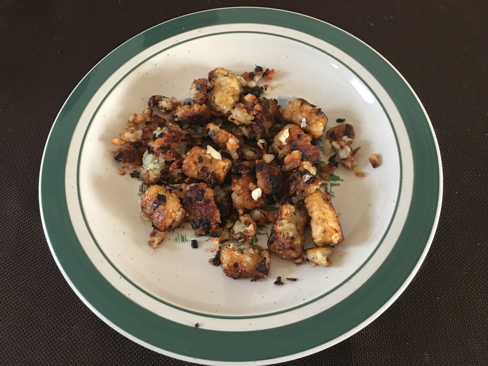

#### Ingredients

1 quarter-inch thick slice of a large onion  
1 clove of garlic  
1/2 tablespoon of butter, YMMV  
12-16 ounces of tater tots  

Finely dice onion and garlic.
Sautée them slab of butter for about ten minutes or until they start turning crispy.
Throw in tater tots and toss them in the pan so that they are covered in the sautée.
Cook for about twenty minutes or until the potatoes are crispy to your liking.
ENJOY.

