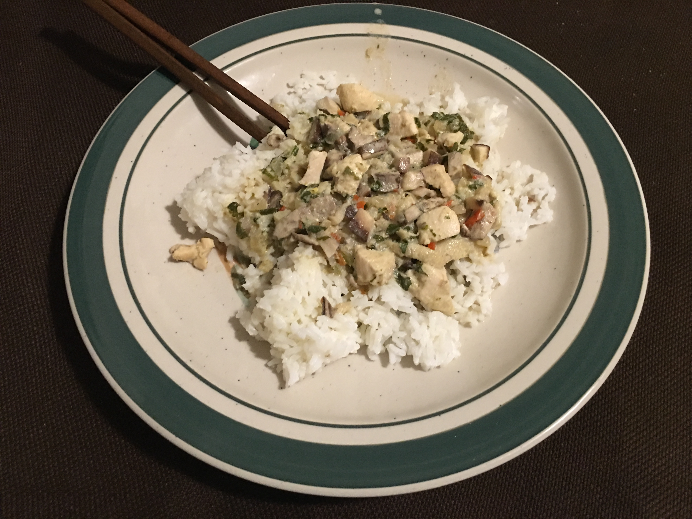

### Ingredients

1/3 large onion  
2 cloves of garlic  
4 tablespoons cilantro  
1 habanero  
1 inch of ginger  
3 cups of chicken stock  
1/2 can of Maesri green curry paste  
1 tablespoon fish sauce  
2 tablespoons of soy sauce  
1 tablespoon sugar  
1 tablespoon lime juice  
1 14 ounce can of coconut  
4 ounces assorted mushrooms  
1/2 pound chicken  
1 1/2 cups of rice  

### Directions

Cook rice and time it such that by the time it's done, it can be served with the rest of your dinner.
Line pan with EVOO, heat on medium, and pour in chicken stock.
Dice garlic, onion, cilantro, and habanero and throw into pan lined with EVOO.
Mince ginger and add to pad as well.
Heat this set of ingredients for 5-10 minutes.
Add coconut milk, fish sauce, soy sauce, sugar, lime juice, and curry paste, and stir into mixture.
Dice mushrooms and chicken and throw into pan.
Continue heating for another 20-30 minutes or until chicken cubes are whitened and cooked.
Put on low and serve on top of rice.

