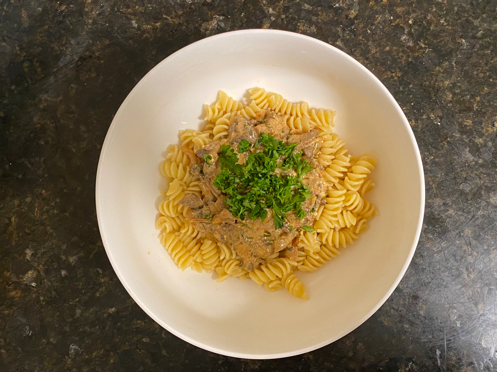

### Ingredients

1/2 large onion  
1 tablespoon of minced garlic  
2 tablespoons of butter  
8 ounces of portabella mushrooms  
8-16 fluid ounces of chicken broth  
2 tablespoons paprika  
2 tablespoons flour  
4 tablespoons minced dill  
1/4 cup Sauvignon blanc wine  
2 tablespoons lemon juice  
2 tablespoons soy sauce  
1/4 cup heavy cream  
4 ounces sour cream  
1 pound of pasta (optional)  
2 tablespoons parsley  

### Procedure

This recipe was adapted from [this web page](https://sundaysuppermovement.com/hungarian-mushroom-soup/).

• Sautée diced onions in butter and minced garlic in large pan until they are browned.  

• Add baby bella mushrooms and some chicken broth, and leave on same heat for a couple of minutes.  

• Mix in paprika and flour and heat for another minute or two.  

• Introduce more chicken broth and scrape the bottom of the pan to make sure nothing is stuck to it.  

• Stir in minced dill, Sauvignon blanc, lemon juice, soy sauce, and heavy cream, tasting the mixture with each addition, making sure it's a good balance of acidic, creamy, and savory.    

• Take the pan off of heat and stir in sour cream until I thought the dish had a beautiful balance of acid, creaminess, and savoryness.  

I wasn’t sure whether or not to serve this as a soup, so I decided to put it over pasta and top it with minced parsley.

