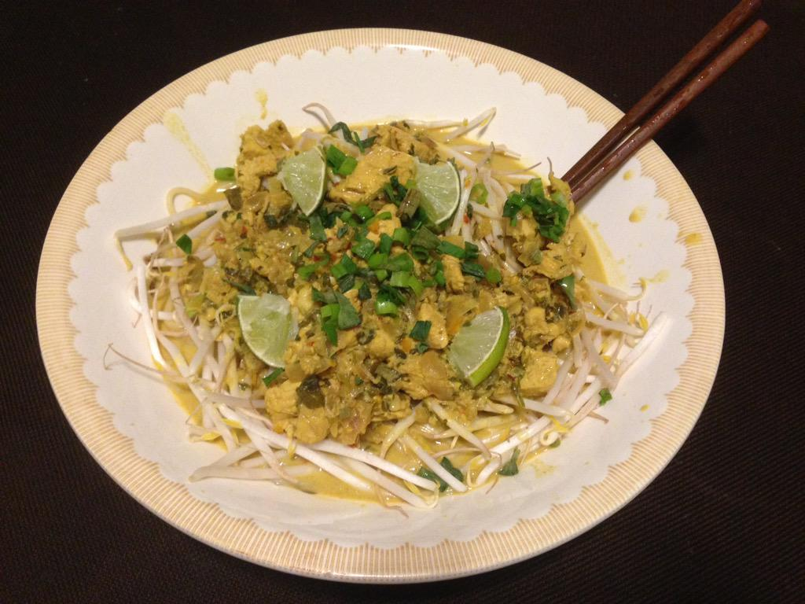

### Part 1 - Sautée onions

#### Ingredients

1/3 chopped red onion  
3 tablespoons chopped cilantro  
1 tablespoon minced ginger  
2 garlic cloves  
1 finely chopped largeish habanero  

Put enough chicken broth in the pan to prevent browning or burning of the above ingredients. Throw them all in there and heat them on medium for about five or ten minutes.

### Part 2 - Make base soup

#### Ingredients

3 tablespoons curry powder  
1/4 tablespoon turmeric  
1/2 tablespoon paprika  
32 fl oz of chicken broth  
14 fl oz of coconut milk  
2 tablespoons fish sauce  
1 tablespoon light brown sugar  
1 tablespoon lime juice  

One by one, add the ingredients above, still on medium heat. Periodically stir and keep heating the soup for about 20-30 minutes. The soup should be quite tasty now and somewhat thickened, not brothy at all.

### Part 3 - Cook chicken

#### Ingredients

1 1/2 chicken breasts  

Chop the chicken breasts into cubes and throw them into the soup until they are whitened.

### Part 4 - Cook noodles

#### Ingredients

1/2 pound vermicelli

Cook the pasta until just past al dente. Drain the noodles and set aside.

### Part 5 - Thicken the soup

##### Ingredients

1/2 pint of half-and-half

Pour in half-and-half and stir in to thicken. Use more or less depending on your desires.

### Part 6 - Time to serve!

#### Ingredients

fresh bean sprouts  
scallions  

Chop the tips of one or two scallions. Get a bowl and fill it about half way with the vermicelli noodles. Then fill the next third of the bowl with fresh bean sprouts. Add the soup until the bowl is about 3/4 full.  Garnish the bowl with the chopped scallions. Mangia!!!

