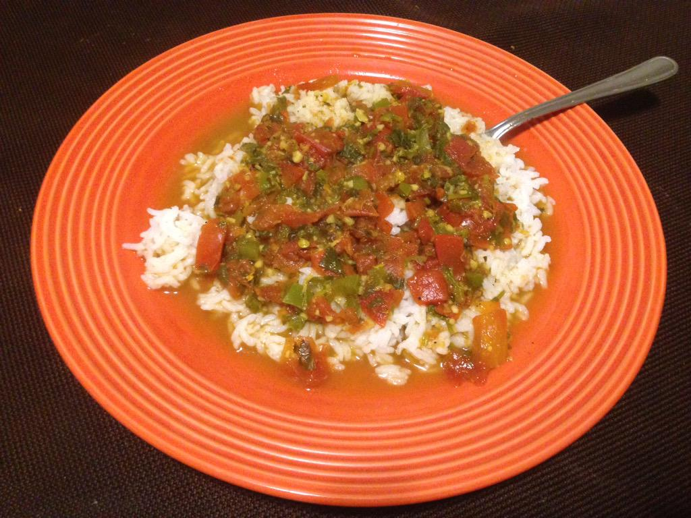

### Part 1 - Sautée onions and tomatoes

#### Ingredients

1/2 large white onion  
3 plum tomatoes  
1 clove or 1 tablespoon of dried garlic flakes  

Dice tomatoes and onion into pieces as small as possible an throw into a pan with the garlic on medium heat. Add water to facilitate boiling and prevent burning.

### Part 2 - Add other spices

#### Ingredients

1⁄4 cup chopped coriander/cilantro  
2 teaspoons or 2 inches of minced ginger  
1 jalapeño pepper, chopped  
1 teaspoon curry powder  
1⁄2 teaspoon ground cumin  
1⁄2 teaspoon black pepper  
2 teaspoons salt  
1⁄4 teaspoon ground mustard  

Add the cilantro, ginger, jalapeño, curry, cumin, black pepper, salt, and mustard. Cook for another 30 minutes at least. 

### Part 3 - Cook rice and serve

#### Ingredients

1 1/2 cups of white rice

Make rice and when done serve meal over it on plate.

