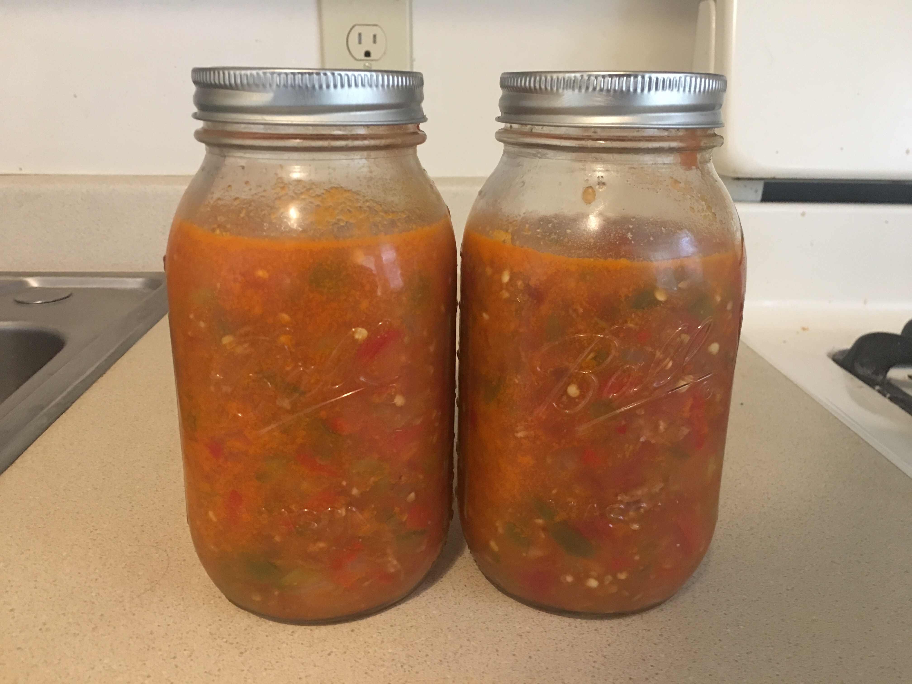

#### Ingredients

4 large tomatoes  
2 habanero peppers  
1 pound of spicy Italian sausage  
1 tablespoon of salt, YMMV  

Put a pan on medium heat and cover bottom with a thin film of EVOO.
Dice all of the sausage and throw into pan.
Cook the sausage until fairly browned.
Remove the sausage and set aside in a large bowl or a plate.
Dice the tomatoes and throw them into the same pan used to cook the sausage.
Dice up the habanero as well and throw it in.
Turn the heat up to somewhere between medium and high.
Add as much water as necessary to keep the sauce from drying out.
Cook for somewhere between 15 and 30 minutes.
Throw in the sausage and stir into the sauce so it isn't clumped together.
Cook for another thirty minutes or so.
Depending on the sweetness of the tomatoes and your taste you should stir in around a tablespoon of salt.
Serve over whatever pasta you desire.

