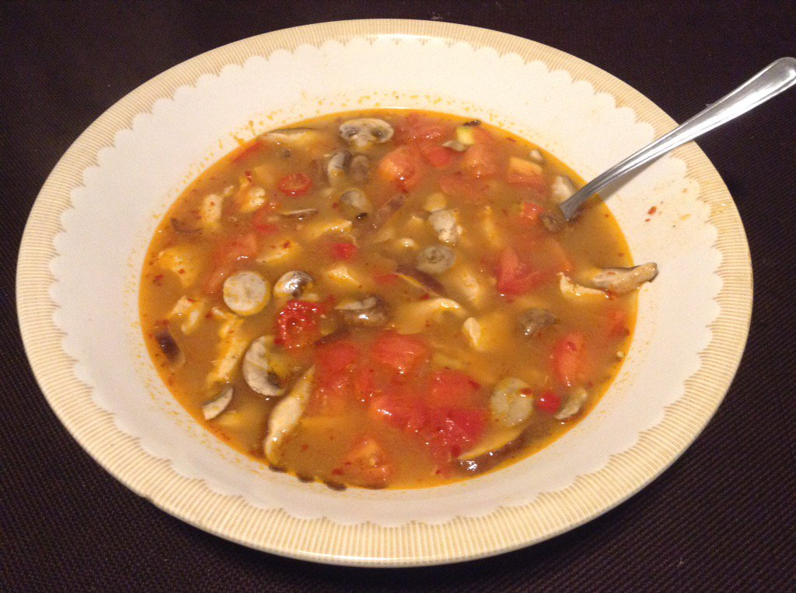

This is adapted from this [recipe](http://www.thaikitchen.com/Recipes/Soups/Tom-Yum-Soup).

### Step 1 - Prepare broth

#### Ingredients

4 cups chicken broth  
1/3 onion diced  
4 tablespoons lime juice  
2 tablespoons fish sauce  
2 tablespoons sugar  
2 lemongrass stalks, cut in halves and taken apart  
1 inch of ginger, minced  

Pour the broth in a pan on high, and add all the ingredients.
Bring to a boil, and let it do so for five minutes.
Turn heat down to medium and let sit for 15 minutes.

### Step 2 - Develop soup

#### Ingredients

3 tablespoons chili paste  
1/2 pound of chicken diced  
1 jalapeño pepper diced  
4 ounces gourmet blend of mushrooms (crimini, shiitake, oyster)  
1 tablespoon red pepper flakes  
3 plum tomatoes, diced  

Remove all lemon grass pieces from soup.
Add all ingredients to soup and let heat for an additional 30 minutes.
Serve in a bowl.
You may want to even serve over pasta or udon.

