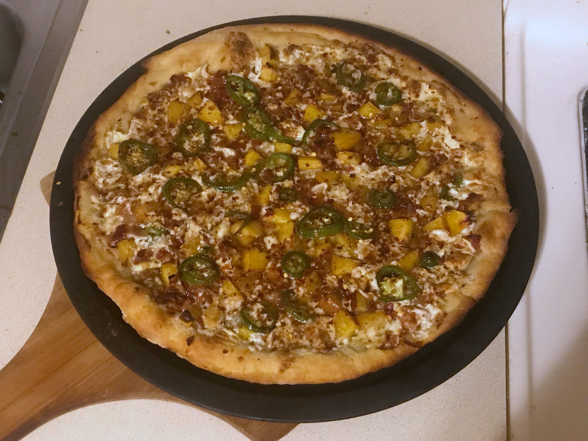
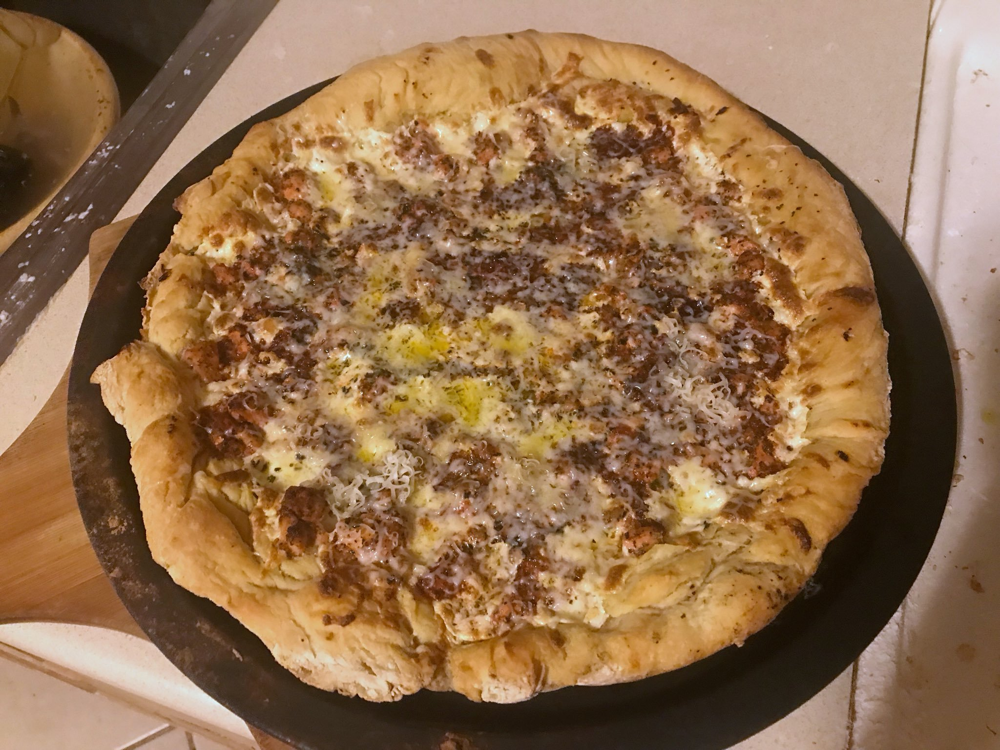
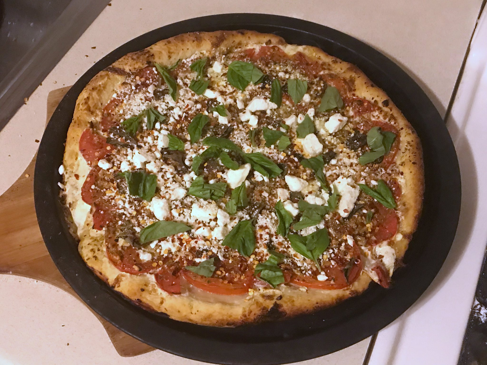
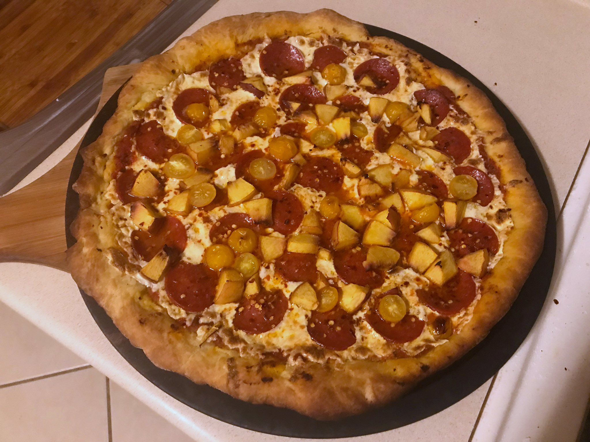
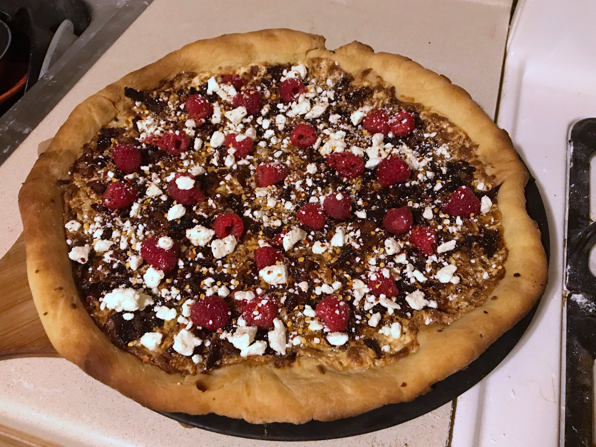

#### Making pizza dough

I make pizza dough from scratch using a tiny variation of Bobby Flay's recipe, [here](https://www.epicurious.com/recipes/member/views/pizza-dough-bobby-flay-5b711de44e722a4f20884ace)

3 1/2 to 4 cups flour  
1 envelope instant dry yeast  
1 tablespoon salt  
1 teaspoon sugar  
2 tablespoons olive oil  
1 1/2 cups hot water  

I just throw everything into a large salad bowl and stir the mixture, gradually adding the hot water and continuing to stir until the dough turns into a wet ball. Then I let it sit somewhere for about an hour. After that I scoop the dough out of the bowl and I repeatedly add flour and knead the dough until it turns into almost like Play-doh. Then I split the ball into two, where each one should be enough for a 14" pizza. Sometimes I put them both away for a day, since dough seems to work better after "aging" a bit, but using one right away is fine.

#### SHOW ME THE PIZZAS

1 pound bacon, cooked and diced  
1 nectarine, diced  
2 jalapeño peppers, sliced neatly  
1/2 pound mozzarella, shredded
1/4 pound blue cheese, shredded
with Balsamic vinegar drizzled all over and of course... red pepper flakes

 

━━━━━━━━━━━━━━ 🍕🍕🍕 ━━━━━━━━━━━━━━ 

 

1 handful of Fuego Takis flavored with cayenne and lime  
2 jalapeño peppers  
5 tablespoons cilantro  
2 limes  
1 tablespoon cumin  
1 tablespoon chili powder  
1 tablespoon salt  
1 tablespoon red pepper flakes  
1 pound chicken, diced  
1 pound mozzarella, shredded  
4 ounces havarti cheese with dill  

Put the Takis, jalapeños, cilantro, lime juice, cumin, chili powder, salt, and red pepper flakes and put in a blender to make a paste. Whiten the chicken, and then continue heat the chicken with the paste mixed in for 5-10 minutes. Create a bedding mozzarella on the pizza dough, and then spread the chicken and paste over it and bake. After done, shred the havarti cheese and sprinkle more cilantro if desired.

 

━━━━━━━━━━━━━━ 🍕🍕🍕 ━━━━━━━━━━━━━━ 

 

2 large tomatoes sliced  
4 garlic cloves, minced  
1 pound mozzarella, shredded  
1 lemon, juiced  
2-3 tablespoons oregano  
3-4 ounces basil, shredded  
5 tablespoons feta cheese  

 

━━━━━━━━━━━━━━ 🍕🍕🍕 ━━━━━━━━━━━━━━

 

8 oz. sliced pepperoni  
1 nectarine, diced  
10 diced golden cherry tomatoes  
1 pound mozzarella, shredded  
8 oz. homemade pizza sauce  

 

━━━━━━━━━━━━━━ 🍕🍕🍕 ━━━━━━━━━━━━━━ 

 

1 pound of bacon, cooked and diced  
2 large onions, caramelized  
1 pound mozzarella, shredded  
5 tablespoons feta cheese  
red raspberries  
red pepper flakes  

