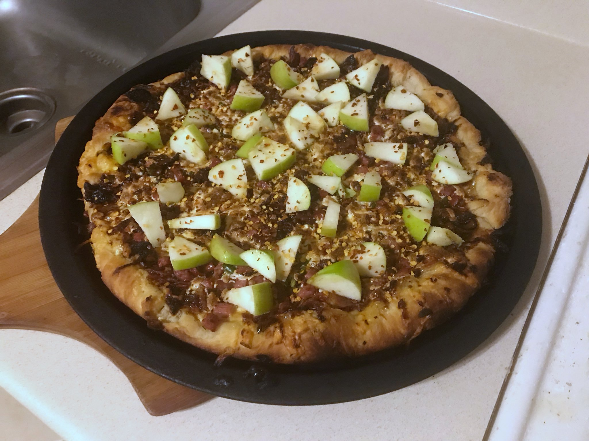

#### Making pizza dough

I make pizza dough from scratch using a tiny variation of Bobby Flay's recipe, [here](https://www.epicurious.com/recipes/member/views/pizza-dough-bobby-flay-5b711de44e722a4f20884ace)

3 1/2 to 4 cups flour  
1 envelope instant dry yeast  
1 tablespoon salt  
1 teaspoon sugar  
2 tablespoons olive oil  
1 1/2 cups hot water  

I just throw everything into a large salad bowl and stir the mixture, gradually adding the hot water and continuing to stir until the dough turns into a wet ball. Then I let it sit somewhere for about an hour. After that I scoop the dough out of the bowl and I repeatedly add flour and knead the dough until it turns into almost like Play-doh. Then I split the ball into two, where each one should be enough for a 14" pizza. Sometimes I put them both away for a day, since dough seems to work better after "aging" a bit, but using one right away is fine.

#### Homemade pizza sauce

1 22 ounce can of Italian plum tomatoes  
1/2 large onion, diced
2-4 cloves garlic, minced  
4 tablespoons cilantro  
4 tablespoons oregano  
4 tablespoons basil, diced  
2-4 tablespoons red pepper flakes  

##### TODO: Add directions for homemade pizza sauce.

#### SHOW ME THE PIZZAS

1 pound applewood smoked bacon  
1/2 pound kielbasa  
2 large onions  
2 tablespoons butter  
apple cider  
1/2 pound smoked Gouda cheese  
1 pound mozzarella cheese  
2 jalapeño peppers  
1 Granny apple  
red pepper flakes  

Cook the bacon until crispy, and dice both it and the kielbasa and set aside. Dice the onions and put into a pan with 2 tablespoons of butter and about 1/2 apple cider. After it is all caramelized, set aside. Dice the jalapeños and Granny apple and set aside. Make a bedding of shredded mozzarella and Gouda cheeses on the pizza dough. Spread the bacon and kielbasa over the pizza, then the onions and finally the jalapeños. _Be sure not to put the apple on before putting the pizza in the oven as it will lose its texture and flavor._ Put in the oven for about ten to fifteen minutes. After baking, spread the diced apple over the pizza, and add red pepper flakes for heat if you like.

1/2-1 cup cauliflower  
4-6 small radishes  
1-2 ounces arugula  
1/4 pound Gorgonzola cheese  
1 pound mozzarella cheese  
Italian dressing  
red pepper flakes  

Make a bedding of mozzarella and Gorgonzola cheeses on top of the pizza dough. Dice the cauliflower and radishes and spread evenly across the pizza. Put in the oven for about ten to fifteen minutes. After baking, spread the arugula evenly, and drizzle Italian dressing all over. Add red pepper flakes if you want some heat.

4 ounces prosciutto  
5-10 tablespoons of banana peppers  
1 pound mozzarella, shredded  
1/2-1 lemon  
4-6 tablespoons feta cheese  
red pepper flakes  

Make a bedding of mozzarella on top of the pizza dough. Dice the prosciutto and spread it and the banana peppers evenly on top of the mozzarella. Juice lemon and sprinkle some of it over the pizza evenly. Put in the oven for about ten to fifteen minutes. After baking, sprinkle the rest of the lemon juice and the red pepper flakes over pizza. Do the same with the feta cheese.

8 oz. sliced pepperoni  
1 pound spicy Italian sausage  
4-6 hot cherry peppers  
1 pound mozzarella, shredded  
8 oz. homemade pizza sauce  

Dice/mince and then brown the sausage first. Then spread the pizza sauce on the dough. Make a bedding of mozzarella on top of the pizza sauce. Arrange the pepperoni evenly on top of the bedding. Dice the cherry peppers and spread them and the sausage evenly on top of the pepperoni. Put in the oven for about ten to fifteen minutes.

1 pound bacon, cooked and diced  
1 nectarine, diced  
2 jalapeño peppers, sliced neatly  
1/2 pound mozzarella, shredded  
1/4 pound blue cheese, shredded  
Balsamic vinegar  
red pepper flakes  

Make a bedding of mozzarella and blue cheeses on the pizza dough. After cooking the bacon and dicing both it and the nectarine as well as the jalapeños, spread it all over the cheeses and then put in the oven. After baking, drizzle the balsamic vinegar and sprinkle red pepper flakes.

1 handful of Fuego Takis flavored with cayenne and lime  
2 jalapeño peppers  
5 tablespoons cilantro  
2 limes  
1 tablespoon cumin  
1 tablespoon chili powder  
1 tablespoon salt  
1 tablespoon red pepper flakes  
1 pound chicken, diced  
1 pound mozzarella, shredded  
4 ounces havarti cheese with dill  

Put the Takis, jalapeños, cilantro, lime juice, cumin, chili powder, salt, and red pepper flakes and put in a blender to make a paste. Whiten the chicken, and then continue heat the chicken with the paste mixed in for 5-10 minutes. Create a bedding mozzarella on the pizza dough, and then spread the chicken and paste over it and bake. After done, shred the havarti cheese and sprinkle more cilantro if desired.

2 large tomatoes  
4 garlic cloves  
1 pound mozzarella, shredded  
1 lemon, juiced  
2-3 tablespoons oregano  
3-4 ounces basil leaves  
5 tablespoons feta cheese  

Make a bedding of mozzarella on the pizza dough. Slice the tomatoes thinly and arrange on top of the bedding. Mince the garlic and spread over the tomatoes. Sprinkle the oregano and spread pieces of basil leaves evenly. Sprinkle only some of the lemon juice over the pizza prior to baking. Put in the oven for about ten to fifteen minutes then drizzle the remainder of the lemon juice and sprinkle as much red pepper flakes and salt as you wish.

8 oz. sliced pepperoni  
1 nectarine  
10 diced golden cherry tomatoes  
1 pound mozzarella, shredded  
8 oz. homemade pizza sauce  

Spread the pizza sauce on the dough first. Then make a bedding of mozzarella on top of the pizza sauce. Arrange the pepperoni evenly on top of the bedding. Dice the nectarine and tomatoes and spread evenly on top of the pepperoni. Put in the oven for about ten to fifteen minutes.

1 pound of bacon  
2 large onions  
1 pound mozzarella, shredded  
5 tablespoons feta cheese  
6-8 ounces of red raspberries  
red pepper flakes  

Dice the onions coarsely and put in a pan on medium heat with some butter and a tablespoon of brown sugar. Stir in water occasionally an continue to watch and stir until they brown and caramelize. Put into a container and set aside. Cook the bacon until crispy and set aside as well. Then make a bedding of mozzarella on top of the pizza dough. Spread the onions and then the bacon evenly on top of the cheese. Put the pizza in the oven for about ten to fifteen minutes. After taking it out, spread the raspberries and feta cheese over the pizza. Add red pepper flakes if you like for added heat.

